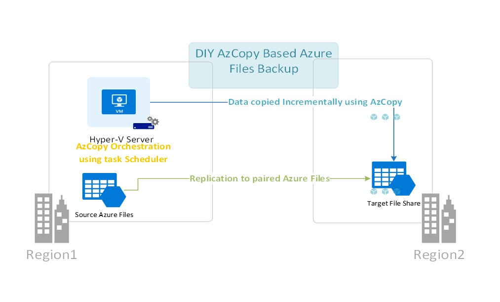

# AzCopy based Azure Files Backup To Another FileShare

Many Azure Files customers who service, choose to implement a backup solution to another file share to be able to recover from unintended changes or deletions to their file systems. The current solution implemented by Azure Backup is snapshot based, which means that it will store data in same file share. This solution will enable you to create your own easy backup solution that automatically creates incremental backups of an Azure Files system on a customer-defined schedule. This webpage provides an overview of the Azure Files AzCopy based backup solution's design and functionality.

## Solution overview

This solution utilizes AzCopy - an purpose-built tool optimized for Azure Storage data movement needs. AzCopy is a command-line utility that you can use to copy blobs or files to or from a storage account. This solution copies snapshots from one file share to the other to ensure fast backups with minimal space overhead. Only changes will be at copied every backup. The copy happens on server side ensuring that it is fast and has minimal egress. This solution utilizes familiar technologies like Windows task Scheduler and Powershell making it easy to maintain without spending time on ramp-up.

## Advantages
* Space efficiency
* Cost Efficiency
* Speed
* Familiar tooling

## Limitations
* There is no exhausive perf testing done and this solution only works on low churn datasets.
* There is no CSS support on this solution.

## Contributions
* This is an open-source community maintained project and we welcome direct contributions to this project.
