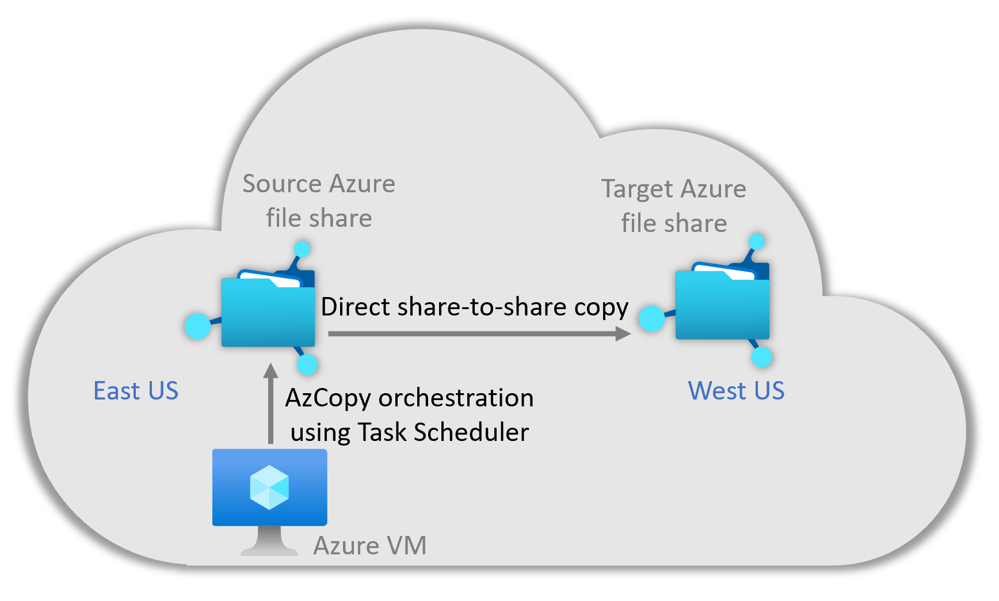

# AzCopy based Azure Files Backup To Another FileShare

Many Azure Files customers who service, choose to implement a backup solution to another file share to be able to recover from unintended changes or deletions to their file systems. The current solution implemented by Azure Backup is snapshot-based, which means that it will store data in same file share. This solution will enable you to create your own easy backup solution that automatically creates incremental backups of an Azure Files system on a customer-defined schedule and stores the backups in a separate storage account. In particular, it enables customers to achieve geographic redundancy for their backups. This webpage provides an overview of the Azure Files AzCopy based backup solution's design and functionality.

## Solution overview

This solution utilizes AzCopy - an purpose-built tool optimized for Azure Storage data movement needs. AzCopy is a command-line utility that you can use to copy blobs or files to or from a storage account. This solution copies snapshots from one file share to the other to ensure fast backups with minimal space overhead. It uses the sync parameter, which is similar to Robocopy /MIR.  Only changes will be at copied with every backup, and any deletions on the source will be mirrored on the target. The copy happens on the server-side, ensuring that it is fast and has minimal egress. This solution utilizes familiar technologies like Windows Task Scheduler and PowerShell, making it easy to maintain without spending time on ramp-up.

## Requirements
* AzCopy version 10.6 or later
* VM on which to run the script (we recommend a VM in the same Azure region as the source file share)

## Advantages
* Space efficiency
* Cost Efficiency
* Familiar tooling

## Limitations
* There has not been exhausive perf testing done.
* This solution works best on low churn datasets and/or datasets with fewer files and folders (the copy rate is less defined by the data size than the number of files and folders being copied over).
  * During initial perf testing, it was observed that a 1TB dataset consisting of 100GB files took about 30 minutes to copy to an empty secondary share.
  * Another 1TB dataset consisting of many small files averaging 0.005GB each took 3 hours to copy to an empty secondary share.
  * After the initial copy to an empty secondary share, the copy time will vary based on the amount of churn, as only changes are copied over.
  * Datasets with more than 50 million files will experience significantly worse performance.
* There is no CSS support on this solution.

## Contributions
* This is an open-source community maintained project and we welcome direct contributions to this project.
